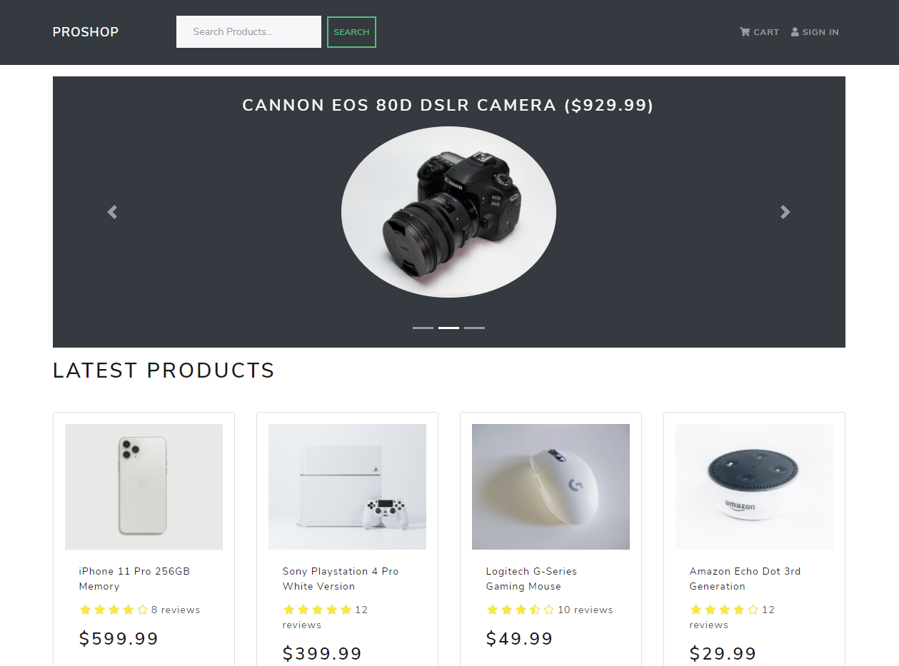

# E-commerce platform from scratch
## Description: 
E-commerce platform from scratch using MERN stack (MongoDB, Express, React, Node) with the following functionality:
- Full featured shopping cart
- Product reviews and ratings
- Top products carousel
- Product pagination
- Product search feature
- User profile with orders
- Admin product management
- Admin user management
- Admin Order details page
- Mark orders as delivered option
- Checkout process (shipping, payment method, etc)
- PayPal / credit card integration
- Custom database seeder script

## The outcome: 

## The Stack: 
Frontend for the app built with **React.js**. Backend built with **Node.js** and **Express**
Database: MongoDB (Atlas), **mongoose**
Packages: **react router dom**, **Redux**, **JSONwebToken**, **bcryptjs**
UI: **react bootstrap**, **react router bootstrap**
Dev: nodemon, concurrently

## The version: 
Completed.

## The online demo: 
[**DEMO**](https://hyfproshopapp.herokuapp.com/)

